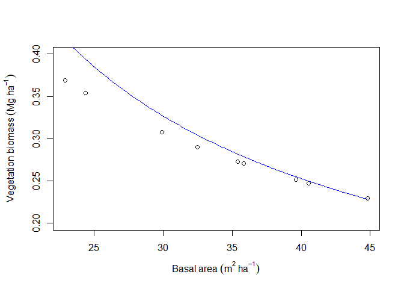

Forest ecology: field
================

This information was collected on October 2015 in Amalfi, Antioquia
(Colombia) by a group of students of Forest engineering of the
Universidad Nacional de Colombia. Luisa Fernanda Gomez, Catalina Zapata,
Jonathan Mafla, Juan Pablo Gonzalez and David Triviño, we made some
plots in a secundary forest, near road to Amalfi. This an information
for the Forest ecology report.

## Reading data

``` r
datos<-read.csv2("datos.csv")
resumidos<-read.csv2("datos_clase.csv")
biomasa<-read.csv2("Biomasa.csv")
regresion<-read.csv2("Regresión.csv")
```

## Heads of data

``` r
head(datos)
```

    ##   No Parcela      DAP        AB.m   Biomasa      AB.ha Biomasa.ha
    ## 1  3      1A 4.042536 0.001283505 3.2080735 0.12835050  320.80735
    ## 2  5      1A 2.005352 0.000315843 0.5674346 0.03158430   56.74346
    ## 3  7      1A 3.819719 0.001145916 2.7887024 0.11459156  278.87024
    ## 4 13      1A 2.832958 0.000630333 1.3325638 0.06303332  133.25638
    ## 5 20      1A 2.037183 0.000325949 0.5899511 0.03259493   58.99511
    ## 6 22      1A 4.456338 0.001559718 4.0815741 0.15597184  408.15741

``` r
head(resumidos)
```

    ##   Intervalo clase N.ha  AB.ha Biomasa.ha
    ## 1       1<5   3.0 3133 1.6411     3.6610
    ## 2      5<10   7.5  653 2.7713     9.3954
    ## 3     10<15  12.5  340 4.0686    17.3443
    ## 4     15<20  17.5  304 7.3160    36.5866
    ## 5     20<25  22.5  140 5.5059    30.8918
    ## 6     25<30  27.5   76 4.4972    27.7964

``` r
head(biomasa)
```

    ##   Parcela N.ha    AB.ha Biomasa.ha Herbacea.ha Hojarasca.ha Bioma.total
    ## 1       1 5560 29.91789   148.5768   0.3076596     5.811103    151.5077
    ## 2       2 5160 35.42299   194.2700   0.2727854     5.997996    197.1915
    ## 3       3 4060 40.52696   234.7469   0.2471466     6.147042    237.6752
    ## 4       4 3900 39.64838   222.6253   0.2511946     6.122767    225.5417
    ## 5       5 5200 32.48301   167.3129   0.2902913     5.902105    170.2390
    ## 6       6 3180 44.80988   273.9410   0.2292081     6.258332    276.8528

``` r
head(regresion)
```

    ##   parcela    n        g    b_anh       vh        hf       bt
    ## 1       1 5560 29.91789 148.5768 2.300234 0.6306943 151.5077
    ## 2       2 5160 35.42299 194.2700 2.327199 0.5943129 197.1915
    ## 3       3 4060 40.52696 234.7469 2.361752 0.5665454 237.6752
    ## 4       4 3900 39.64838 222.6253 2.345365 0.5709939 225.5417
    ## 5       5 5200 32.48301 167.3129 2.313327 0.6127586 170.2390
    ## 6       6 3180 44.80988 273.9410 2.365253 0.5465115 276.8528

## Plot

``` r
with(regresion, plot(b_anh, xlab="Plots", ylab="Aboveground biomass"))
```

<!-- -->

## Linear regression

``` r
mod.lin<-lm(b_anh~n,regresion)
summary(mod.lin)
```

    ## 
    ## Call:
    ## lm(formula = b_anh ~ n, data = regresion)
    ## 
    ## Residuals:
    ##      Min       1Q   Median       3Q      Max 
    ## -100.231   -7.573   10.826   24.711   38.005 
    ## 
    ## Coefficients:
    ##              Estimate Std. Error t value Pr(>|t|)   
    ## (Intercept) 342.54229   73.45060   4.664   0.0023 **
    ## n            -0.03352    0.01523  -2.201   0.0636 . 
    ## ---
    ## Signif. codes:  0 '***' 0.001 '**' 0.01 '*' 0.05 '.' 0.1 ' ' 1
    ## 
    ## Residual standard error: 43.88 on 7 degrees of freedom
    ## Multiple R-squared:  0.4091, Adjusted R-squared:  0.3247 
    ## F-statistic: 4.846 on 1 and 7 DF,  p-value: 0.0636

## Vegetation biomass

``` r
{op <- par(mar = c(5,4.5,4,2) + 0.1)
with(biomasa, plot(AB.ha,Herbacea.ha,xlab=expression("Basal area"~(m^{2}~ha^{-1})),
                   ylab=expression("Vegetation biomass"~(Mg~ha^{-1})),ylim=c(0.2,0.4)))
par(new=T)
AB=seq(19,45,0.1)
VH<-function(AB){
        Vh=100.235*exp(-4.009^(AB^0.069))}
Vh<-VH(AB)
plot(Vh~AB,type="l",xlab="",ylab="",main="",col="blue",axes=F,ylim=c(0.2,0.4))
}
```

<!-- -->

## Leaf litter

``` r
Hoja<-function(AB){
        hoja=1.112*log(1+6.184*AB)
}
hoja<-Hoja(AB)


{ op <- par(mar = c(5,4.5,4,2) + 0.1)
  with(biomasa,plot(AB.ha,Hojarasca.ha,xlab=expression("Basal area"~(m^{2}~ha^{-1})),
                  ylab=expression("Leaf litter"~(Mg~ha^{-1}))))
par(new=T)
plot(hoja~AB,type="l",xlab="",ylab="",main="",col="blue",axes=F,ylim=c(5.2,6.4))}
```

<!-- -->

## Diametric classes

``` r
clases<-as.character(resumidos$clase)
clases=c("3","7,5","12,5","17,5","22,5","27,5","32,5","37,5","42,5","47,5","52,5","57,5")
op <- par(mar = c(5,4.5,4,2) + 0.1)
with(resumidos, barplot(Biomasa.ha,space=c(0,0),names.arg=clases,las=2,
                        ylab=expression("Biomass"~(Mg~ha^{-1})),
                        xlab=expression("Diametric classes"~(cm)), col="white"))
```

<!-- -->

``` r
op <- par(mar = c(5,4.5,4,2) + 0.1)
with(resumidos, barplot(AB.ha,space=c(0,0),names.arg=clases,las=2,
                        ylab=expression("Área basal"~(m^{2}~ha^{-1})),
                        xlab=expression("Clase diamétrica"~(cm)), col="white"))
```

<!-- -->

``` r
lim.int=c(1,seq(5,60,5))
{histograma<-hist(datos$DAP,breaks=lim.int,main="", ylab="Frecuencia", 
                 xlab="Diámetro (cm)", probability=T)
lines(density(datos$DAP),col="blue")
mtext(c(-2,0,2), side=2, las=1, at=c(-2,0,2), line=0.3, col="blue", cex=0.1)}
```

<!-- -->

## Vegetation and leaf litter

``` r
{
  op <- par(mar = c(5,4.5,4,2) + 0.1)
  with(biomasa, plot(AB.ha,Herbacea.ha,xlab=expression("Área basal"~(m^{2}~ha^{-1})),
ylab=expression("Biomasa"~(Mg~ha^{-1})),ylim=c(0,6.3),col="chartreuse4",pch=2))
par(new=T)
AB=seq(19,45,0.1)
VH<-function(AB){
        Vh=100.235*exp(-4.009^(AB^0.069))}
Vh<-VH(AB)
plot(Vh~AB,type="l",xlab="",ylab="",main="",col="chartreuse4",axes=F,ylim=c(0,6.3))
par(new=T)
plot(biomasa$AB.ha,biomasa$Hojarasca.ha,xlab="",ylim=c(0,6.3),
                  ylab="",col="chocolate4",pch=10,axes=F)
par(new=T)
plot(hoja~AB,type="l",xlab="",ylab="",main="",col="chocolate4",axes=F,ylim=c(0,6.3))
legend(40, 4, legend=c("Leaf litter", "Vegetation"), col = c("chocolate4", "chartreuse4"),
       pch=c(10,2))
}
```

<!-- -->
